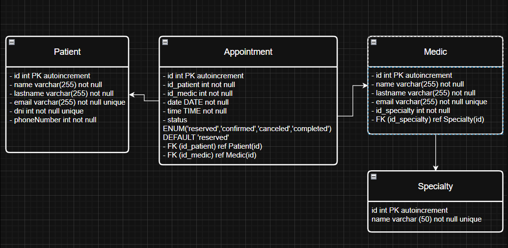

# Aplicación de gestión de turnos

## Participantes
- Franco Julian Rossi  
- Martin Andres Garnica  
- Manuel Galdames  
- Santiago Recari

## Descripción
Aplicación para la gestión de turnos en clínicas/consultorios. Permite crear, modificar, cancelar y notificar cambios en turnos para pacientes y médicos. Incluye una API backend (Node.js + TypeScript) y un frontend (Vite + React + TypeScript).

## Funcionalidades principales
- Registro y gestión de pacientes y médicos.
- Gestión de especialidades.
- CRUD de turnos (reservar, confirmar, cancelar, completar).
- Notificaciones automáticas a paciente y médico cuando cambia el estado de un turno.
- Seed de datos para pruebas.

## Arquitectura / Estructura del proyecto
- Backend/
  - src/
    - controllers/ — lógica de endpoints
    - models/sqlite/ — entidades y modelos (usa SQLite para desarrollo)
    - observer/ — implementación del patrón Observer (subject + observers de paciente y médico)
    - services/ — mailer y servicio de notificaciones
    - routes/ — rutas REST: appointment, medic, patient, speciality
    - scripts/seeds.ts — script para poblar datos de prueba
  - .env — variables de entorno
  - jest.config.js — configuración de tests
- Frontend/
  - src/
    - pages/ — vistas (patientPage, patientFormularioPage)
    - services/ — consumo de API desde el cliente
    - components/ — componentes reutilizables
  - vite.config.ts — configuración de Vite

## Tecnologías
- Backend: Node.js, TypeScript
- Base de datos (desarrollo): SQLite (archivos en src/models/sqlite/config/)
- Frontend: React + TypeScript, Vite
- Tests: Jest (backend)
- Patrones de diseño: Singleton (config/DB), Observer (notificaciones de turnos)

## Diseño y patrones
- Singleton: conexión/configuración de la base de datos para evitar múltiples instancias.
- Observer: cuando un turno cambia de estado, se notifica a los observers (paciente, médico). La clase Turno dispara eventos sin saber cómo se gestionan las notificaciones.

## Endpoints principales (resumen)
- /api/patients — gestión de pacientes
- /medics — gestión de médicos
- /specialities — gestión de especialidades
- /appointments — gestión de turnos

(Ver carpetas `routes/` y `controllers/` para la lista completa y métodos disponibles.)

## Cómo ejecutar (Windows)
1. Backend
   - Abrir terminal en `Backend`:
     - npm install
     - Copiar `.env` ejemplo y ajustar variables (si aplica)
     - npm run dev     (o `npm start` según scripts)
     - npm test        (ejecuta los tests con Jest)
     - npm run seed    (si existe, ejecuta el script de seeds para poblar la BD)
2. Frontend
   - Abrir terminal en `Frontend`:
     - npm install
     - npm run dev     (inicia Vite en modo desarrollo)
     - npm run build   (si se requiere generar build de producción)

Nota: si la configuración usa TypeScript en runtime, puede ser necesario compilar `tsc` o usar `ts-node` según la configuración del package.json.

## Diagrama ER

## Licencia
Proyecto académico.